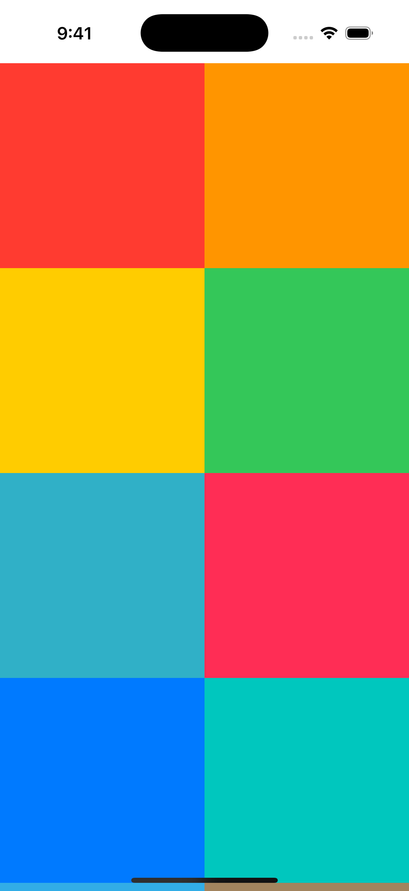
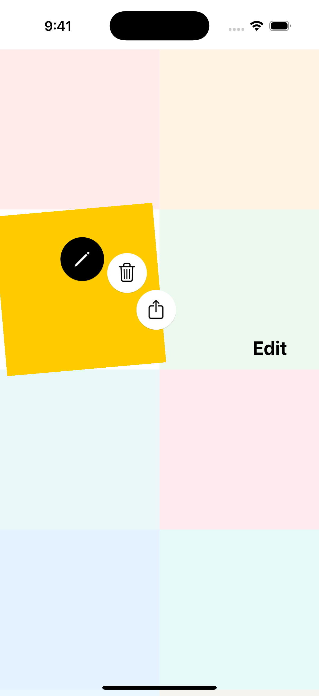
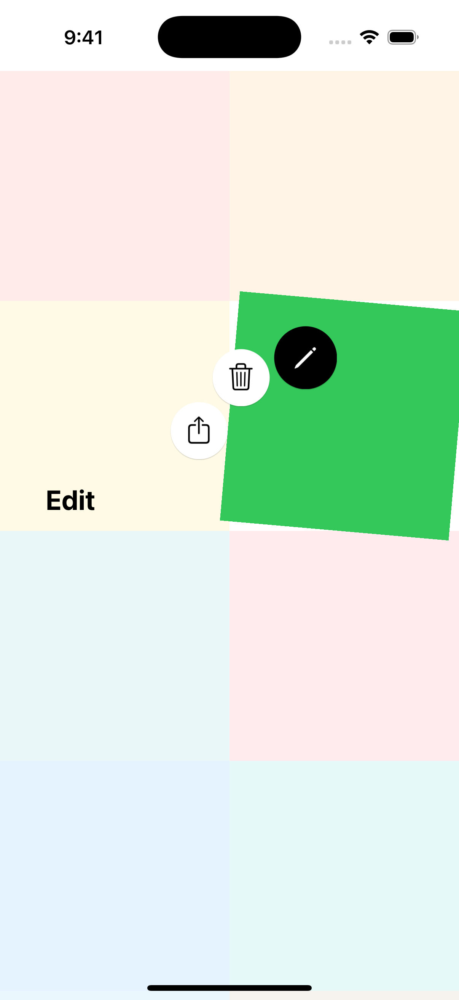

# CircularContextMenu

A customizable circular context menu library for iOS applications. Provides an intuitive radial menu interface with support for long-press and tap gestures.

English | [한국어](README.ko.md)

## Screenshots

<p align="center">
  
  
  
</p>

## Features

- **Circular Layout**: Menu items are arranged in an arc around the touch point
- **Gesture Support**: Both long-press (drag to select) and tap interactions
- **View Highlighting**: Optional visual effects when menu is displayed
- **Customizable Appearance**: Configure colors, sizes, animations, and more
- **Pure UIKit**: No external dependencies
- **Smooth Animations**: Polished presentation and dismissal animations
- **Smart Positioning**: Automatically adjusts menu position to stay on screen

## Requirements

- iOS 16.0+
- Swift 5.9+
- Xcode 15.0+

## Installation

### Swift Package Manager

Add CircularContextMenu to your project via Xcode:

1. File > Add Package Dependencies
2. Enter the repository URL: `https://github.com/songmoro/CircularContextMenu.git`
3. Select version requirements

Or add it to your `Package.swift`:

```swift
dependencies: [
    .package(url: "https://github.com/songmoro/CircularContextMenu.git", from: "0.1.0")
]
```

### CocoaPods

Add to your `Podfile`:

```ruby
pod 'CircularContextMenu', '~> 0.1.0'
```

Then run:

```bash
pod install
```

## Usage

### Basic Long-Press Menu

```swift
import CircularContextMenu

// Define menu items
let items: [CircularMenuItemProtocol] = [
    CircularMenuItem(
        name: "Edit",
        image: UIImage(systemName: "pencil"),
        backgroundColor: .systemYellow
    ) {
        print("Edit tapped")
    },
    CircularMenuItem(
        name: "Delete",
        image: UIImage(systemName: "trash"),
        backgroundColor: .systemRed
    ) {
        print("Delete tapped")
    },
    CircularMenuItem(
        name: "Share",
        image: UIImage(systemName: "square.and.arrow.up"),
        backgroundColor: .systemBlue
    ) {
        print("Share tapped")
    }
]

// Add long-press menu to a view
CircularMenuManager.shared.addLongPressMenu(
    to: myView,
    targetView: myView,
    items: items,
    presentingViewController: self
)
```

### Tap Menu

For a tap-based menu where users select items by tapping (instead of dragging):

```swift
CircularMenuManager.shared.addTapMenu(
    to: myView,
    targetView: myView,
    items: items,
    presentingViewController: self
)
```

### Manual Presentation

You can also manually present a menu at a specific point:

```swift
CircularMenuManager.shared.showMenu(
    at: CGPoint(x: 200, y: 300),
    selectedView: myView,
    items: items,
    from: self
)
```

## Customization

### View Highlighting

Configure how the selected view is highlighted when the menu appears:

```swift
// Contextual rotation (default)
CircularMenuManager.shared.addLongPressMenu(
    to: myView,
    targetView: myView,
    items: items,
    presentingViewController: self,
    highlightConfiguration: .withContextualRotation()
)

// Scale effect
CircularMenuManager.shared.addLongPressMenu(
    to: myView,
    targetView: myView,
    items: items,
    presentingViewController: self,
    highlightConfiguration: .withScale
)

// Custom rotation angle
CircularMenuManager.shared.addLongPressMenu(
    to: myView,
    targetView: myView,
    items: items,
    presentingViewController: self,
    highlightConfiguration: .withCustomRotation(angle: 10)
)

// No effects
CircularMenuManager.shared.addLongPressMenu(
    to: myView,
    targetView: myView,
    items: items,
    presentingViewController: self,
    highlightConfiguration: .default
)
```

### Menu Appearance

Customize menu appearance by modifying constants:

```swift
// Customize the menu view controller
CircularMenuManager.shared.addLongPressMenu(
    to: myView,
    targetView: myView,
    items: items,
    presentingViewController: self,
    customization: { menuVC in
        menuVC.buttonSize = 60
        menuVC.menuRadius = 120
        menuVC.animationDuration = 0.4
    }
)
```

### Global Constants

You can also modify global constants for consistent styling across your app:

```swift
// Modify constants (affects all menus)
CircularMenuConstants.Layout.buttonSize = 60
CircularMenuConstants.Layout.menuRadius = 120
CircularMenuConstants.Animation.duration = 0.4
```

### Custom Menu Items

Create custom menu items by conforming to `CircularMenuItemProtocol`:

```swift
struct MyCustomMenuItem: CircularMenuItemProtocol {
    let name: String
    let image: UIImage?
    let backgroundColor: UIColor
    let action: (() -> Void)?

    // Add custom properties
    let priority: Int
    let isDestructive: Bool
}
```

## Architecture

The library is organized into the following components:

- **Core**: Protocol definitions and core utilities
  - `CircularMenuItemProtocol`: Menu item protocol
  - `ViewHighlightManager`: Handles view highlighting effects
  - `ViewHighlightEffect`: Visual effect configurations

- **View**: UI components
  - `CircularMenuViewController`: Main menu view controller
  - `CircularMenuButton`: Individual menu button
  - `TapMenuViewController`: Tap-based menu variant

- **ViewModel**: Business logic and gesture handling
  - `CircularMenuManager`: Main manager (singleton)
  - `CircularMenuGestureHandlers`: Gesture recognizer handlers

- **Model**: Data models and constants
  - `CircularMenuConstants`: Configuration constants

## Example

For a complete sample application demonstrating various features of CircularContextMenu, check out the example repository:

**[CircularContextMenu-Example](https://github.com/songmoro/CircularContextMenuExample)**

The example project includes:
- Collection view with circular menu integration
- Both long-press and tap menu demonstrations
- Various customization examples
- Real-world usage patterns

## License

CircularContextMenu is available under the MIT license. See the LICENSE file for more info.

## Author

songmoro

## Contributing

Contributions are welcome! Please feel free to submit a Pull Request.
